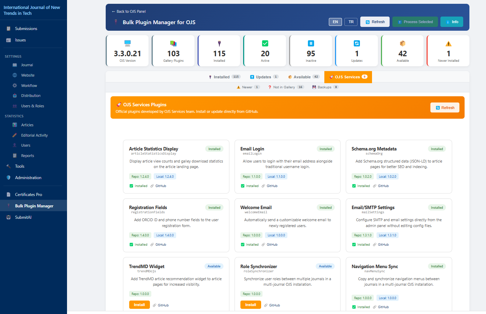

# OJS Toplu Eklenti Yöneticisi


Open Journal Systems (OJS) 3.3.x için kapsamlı eklenti yönetim paneli. Tüm eklentilerinizi tek sayfadan yönetin, güncelleyin, kurun ve sorunları giderin.



## Özellikler

- **Dashboard** - Tüm eklentilerin durum özetini tek bakışta görün
- **Toplu İşlem** - Birden fazla eklentiyi seçip tek seferde güncelleyin/kurun
- **OJS Services** - [github.com/ojs-services](https://github.com/ojs-services) eklentilerini doğrudan kurun
- **DB Senkronizasyon** - OJS eklenti sayfasını çökerten veritabanı-dosya uyumsuzluklarını tespit edip onarın
- **Yedekleme & Geri Yükleme** - Güncelleme sırasında otomatik yedek, tek tıkla geri yükleme
- **PKP Gallery** - Resmi PKP Eklenti Galerisi'nden uyumlu eklentileri kurun
- **Kenar Menüsü** - OJS tarzı sol menü ile hızlı navigasyon
- **Çift Dil** - Türkçe ve İngilizce arayüz

## Kurulum

1. [Releases](../../releases) sayfasından `bulkPluginManager.tar.gz` dosyasını indirin
2. OJS kurulumunuzdaki `plugins/generic/` klasörüne çıkartın
3. Web Sitesi Ayarları > Eklentiler > Genel Eklentiler altından **Bulk Plugin Manager**'ı etkinleştirin

## Erişim

```
https://siteniz.com/index.php/DERGI/bulkPluginManager
```

Veya OJS kenar menüsündeki **Bulk Plugin Manager** bağlantısına tıklayın.

## Uyumluluk

OJS 3.3.0.0 - 3.3.0.22

## Lisans

[GPL v3](LICENSE)

## Geliştirici

[OJS Services](https://github.com/ojs-services)
